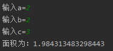
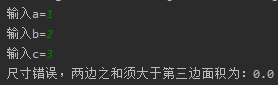
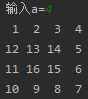
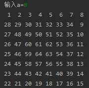
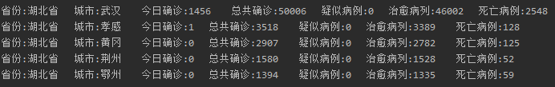

## 实验内容

1. 从键盘输入3个浮点数作为三角形三边的边长，试计算三角形的面积。

2. 编程序，显示螺旋方阵 

   ​     1     2    3    4

   ​     12 13 14    5

   ​     11 16 15    6

   ​     10   9    8   7

3. 读取疫情数据，并输出确认人数最高的5个地区。

## 运行结果

### 计算三角形面积

依次输入`a = 2`,`b = 2`,`c = 3`，可以输出如下结果：

而一次输入`a = 1`,`b = 2`,`c = 3`，则输出如下结果：

### 螺旋方阵

输入`a = 4`，则可以输出如下图形：

此螺旋方阵程序可以自定义行数及列数，当输入`a = 8`，则可以输出如下图形：

### 疫情数据

程序自动从网页得到数据，通过正则表达式处理信息，再依照各个城市的累计确诊数，列出其中确诊数最多的五个城市的具体信息。

